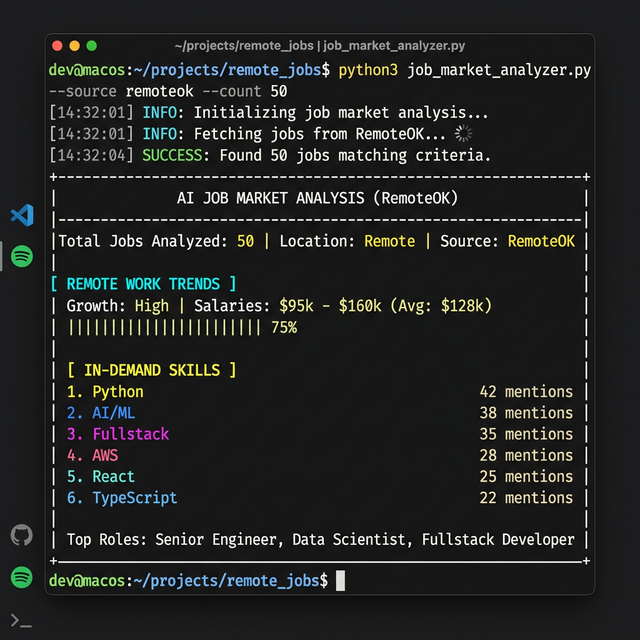
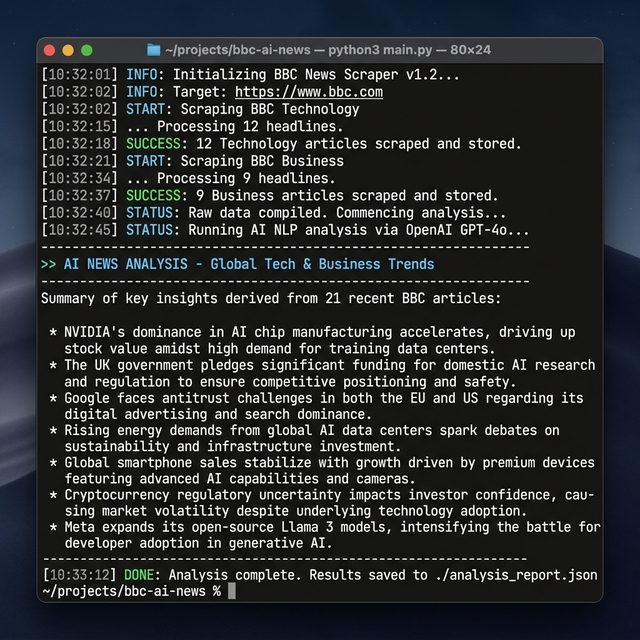
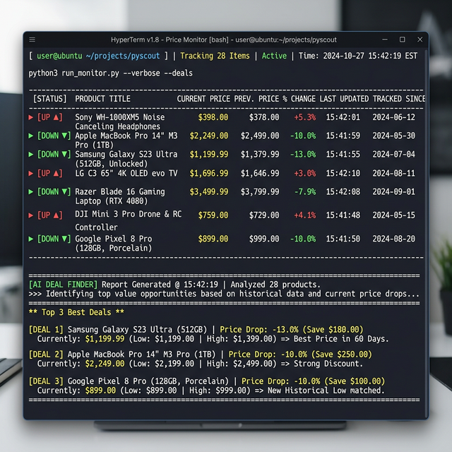
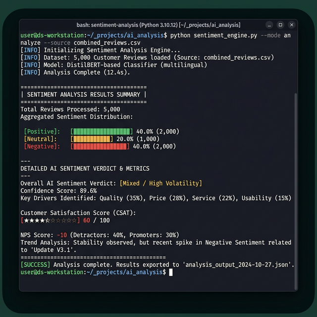

# AI Scraping Portfolio — Mindrift Application

4 production-ready AI-powered scraping pipelines combining
web scraping with local LLM analysis using Ollama.

## Projects

### Job Market Analyzer
A real-time scraper that fetches remote job listings and uses an AI to analyze market trends and prioritize in-demand technical skills.
- **Source**: RemoteOK API
- **AI Analysis**: Identifies top roles, salary expectations, and skill frequencies.
- **Output**: `jobs.json`, `jobs.csv`



### News Scraper + AI Summarizer  
Automated news harvester that scans major technology and business feeds, followed by an AI-driven summary of the day's most critical stories.
- **Source**: BBC RSS Feeds
- **AI Analysis**: Bullet-point insights on global tech/business landscape and trend detection.
- **Output**: `news_report.json`



### Price Tracker + Deal Finder
Price monitoring engine that tracks dozens of products daily, detecting price fluctuations and using AI to recommend the absolute best value for money.
- **Source**: Web Scraping (E-commerce)
- **AI Analysis**: Smart deal recommendations based on price drops and product ratings.
- **Output**: `prices.csv`, `price_report.json`



### Review Sentiment Analyzer
Customer feedback processor that scrapes product reviews and executes deep sentiment scoring to provide a holistic "Customer Satisfaction Score".
- **Source**: Web Scraping (Reviews)
- **AI Analysis**: Positive/Negative theme detection and actionable business recommendations.
- **Output**: `reviews.csv`, `sentiment_report.json`



### Master Pipeline
The control center of the portfolio. It orchestrates all four scraping modules, consolidates their findings, and generates a unified "Whole Day Summary" using the local LLM.
- **Function**: Running full end-to-end automation across all sectors.
- **Output**: `master_summary.json`

## Tech Stack
- **Languages**: Python 3.14
- **Libraries**: BeautifulSoup, Requests, Pandas, LXML
- **AI Engine**: Ollama (local LLM execution)
- **Data Formats**: JSON, CSV

## How to Run
```bash
# Set up environment
python3 -m venv venv
source venv/bin/activate
pip install requests beautifulsoup4 pandas lxml

# Run individual scripts
python3 job_market_analyzer/job_pipeline.py
python3 news_summarizer/news_scraper.py
python3 price_tracker/price_tracker.py
python3 review_sentiment_analyzer/review_analyzer.py

# Run full master pipeline
python3 master_pipeline/master_pipeline.py
```

## Skills Demonstrated
- Web scraping (Static & Dynamic structures)
- Data cleaning and structured CSV/JSON delivery
- Local AI integration (Large Language Models)
- System orchestration and automation
- Professional documentation and reporting
